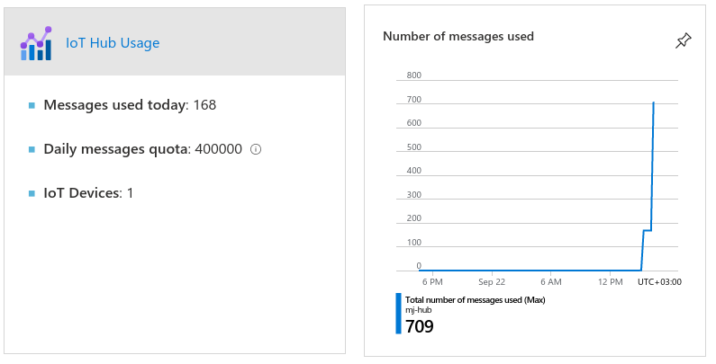

# Azure IoT Hub Synpse example

Azure IoT Hub example contains IoT application example for Azure public cloud integration

Synpse is not competing with any of the Public Cloud offerings. Contrary - it adds value ontop.

Most public cloud providers gives users a framework to interact with their devices and consume their data.
It is very much `SAAS` layer product. Where `Synpse` allows you to manage devices in the lower layers, more like a `PAAS`.

Working together with public cloud offerings you can create bespoke architectures.

Cloud providers mostly provides "IoT hubs" for data ingestion and application layer interactions via MQTT. This allows 
application layer integration. For the embedded applications this is fine when application are part of hardware. But in the 
"age of containers" we are used to packaging application outside of hardware and iterate on both independently.

This is where Synpse comes in. It allows deploy and interact with your application as deployments. This way you can decouple your 
application logic from hardware.


## Azure IoT Hub 

Configure Azure IoT Hub for this example.

1. Create Azure IoT hub:
```
az iot hub create --resource-group MyResourceGroup --name MyIotHub --location eastus --tags synpse=true
```

2. Create certificate based on https://docs.microsoft.com/en-us/azure/iot-hub/tutorial-x509-self-sign

```
Thumbprint 1: SHA1 Fingerprint=56:0E:78:56:74:F1:1B:60:73:AA:7C:8E:12:73:C4:62:01:D5:A3:10 
Thumbprint 2: SHA1 Fingerprint=81:EB:0B:27:BB:3F:BB:D8:91:AF:38:28:BE:83:E5:46:C3:0F:4D:DE

#remove colons ':'

az iot hub device-identity create -n MyIotHub -d synpse --am x509_thumbprint --ptp "560E785674F11B6073AA7C8E1273C46201D5A310" --stp "81EB0B27BB3FBBD891AF3828BE83E546C30F4DDE"
```

3. Create connection string for devices:
```
az iot hub connection-string  show --hub-name MyIotHub --device-id synpse
```

Note the connection string. We will use it when deploying Synpse application.
Where to send messages really depends on your cloud architecture.

For this example we gonna create message route to storage account blob.

4. Create storage account:
```
az storage account create -n MyStorageAccountName -g MyResourceGroup -l eastus
```

5. Create container/bucket for results:
```
az storage container create --account-name MyStorageAccountName -n metrics
```

6. Create IoT hub endpoint for message routing:
```
storageConnectionString=$(az storage account show-connection-string --name MyStorageAccountName --query connectionString -o tsv)

az iot hub routing-endpoint create --resource-group MyResourceGroup --hub-name MyIotHub \
        --endpoint-name storage --endpoint-type azurestoragecontainer --endpoint-resource-group MyResourceGroup \
        --endpoint-subscription-id $(az account show | jq -r .id) --connection-string $storageConnectionString \
        --container-name metrics --batch-frequency 60 --chunk-size 10 \
        --ff {iothub}-{partition}-{YYYY}-{MM}-{DD}-{HH}-{mm}
```

7. Get the endpoint name
```
az iot hub routing-endpoint list --hub-name mj-hub
```

7. Use routing in question with our HUB (endpoint name is same as --endpoint-name)
```
az iot hub route create -g MyResourceGroup --hub-name MyIotHub --endpoint-name storage --source-type DeviceMessages --route-name Route --condition true --enabled true
```

# Deploy application

Deploy Synpse application. Modify application yaml with your thing endpoint.

1. Create certificate secrets

```
synpse secret create azure-crt -f device1.crt
synpse secret create azure-key -f device1.key
```

Deploy the application. Modify other values inside yaml file 

```
synpse deploy -f synpse-azure-example.yaml
```




Once running, you should see application running and data coming into Azure storage account blob.


# WTF's

1. Certificate configuration path is painful... Very...

2. Events lands to storage with random delay, with no visibility why... 
