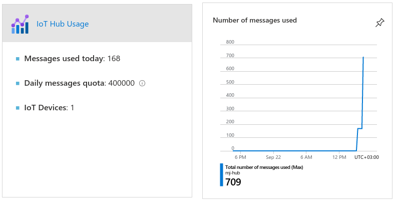
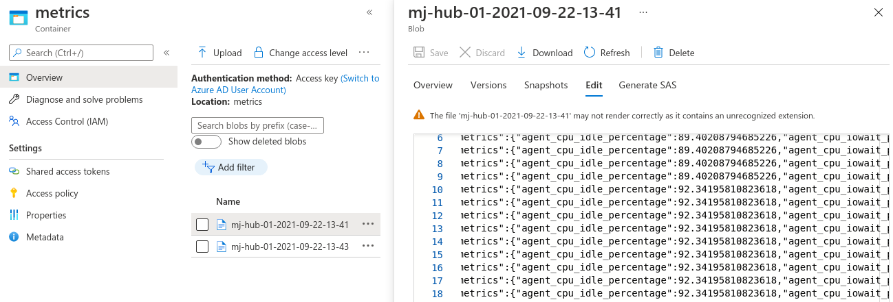

## Azure IoT Hub 

Configure Azure IoT Hub for this example.

1. Create Azure IoT hub:
```
az iot hub create --resource-group MyResourceGroup --name MyIotHub --location eastus --tags synpse=true
```

2. Create device identity:
```
az iot hub device-identity create -n MyIotHub -d synpse  --ee
```

3. Create connection string for devices:
```
az iot hub connection-string  show --hub-name MyIotHub --device-id synpse
```

Note the connection string. We will use it when deploying Synpse application.
Where to send messages really depends on your cloud architecture.

For this example we gonna create message route to storage account blob.

4. Create storage account:
```
az storage account create -n MyStorageAccountName -g MyResourceGroup -l eastus
```

5. Create container/bucket for results:
```
az storage container create --account-name MyStorageAccountName -n metrics
```

6. Create IoT hub endpoint for message routing:
```
storageConnectionString=$(az storage account show-connection-string --name MyStorageAccountName --query connectionString -o tsv)

az iot hub routing-endpoint create --resource-group MyResourceGroup --hub-name MyIotHub \
        --endpoint-name storage --endpoint-type azurestoragecontainer --endpoint-resource-group MyResourceGroup \
        --endpoint-subscription-id $(az account show | jq -r .id) --connection-string $storageConnectionString \
        --container-name metrics --batch-frequency 60 --chunk-size 10 \
        --ff {iothub}-{partition}-{YYYY}-{MM}-{DD}-{HH}-{mm}
```

7. Get the endpoint name
```
az iot hub routing-endpoint list --hub-name mj-hub
```

7. Use routing in question with our HUB (endpoint name is same as --endpoint-name)
```
az iot hub route create -g MyResourceGroup --hub-name MyIotHub --endpoint-name storage --source-type DeviceMessages --route-name Route --condition true --enabled true
```

# Deploy application

Deploy Synpse application. Modify application yaml with your thing endpoint.

1. Create connection string secret, 

> Important: Append to the string ;DeviceID=synpse

```
synpse secret create azure-conn-string -v "HostName=myHub.azure-devices.net;SharedAccessKeyName=iothubowner;SharedAccessKey=YqVZ65xzQH/xxxxxxxxxxxxxxxx/xxxxxxxxxx;DeviceId=synpse"
```

Deploy the application

```
synpse deploy -f synpse-azure-example.yaml
```




Once running, you should see application running and data coming into Azure storage account blob.


